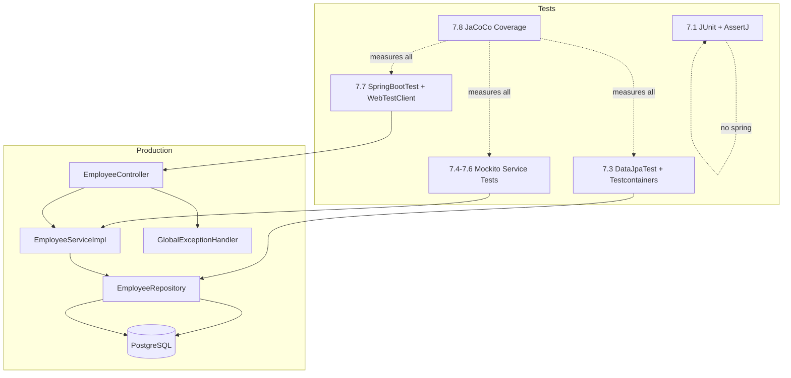

# Spring Testing Mentor Guide — Week 7 (Topics 7.1 to 7.8)

> **Project:** `TestingApp_week7`  
> **Stack:** Spring Boot 4.1.0 · Java 21 · JUnit 5 · Mockito · AssertJ · Testcontainers · PostgreSQL · JaCoCo  
> **Audience:** Java Backend Developer interview prep (2+ years experience)

---

## Table of Contents

1. [Project Overview](#project-overview)
2. [Git Commit Map](#git-commit-map)
3. [Topic 7.1 — JUnit 5 Fundamentals & AssertJ](#topic-71--junit-5-fundamentals--assertj)
4. [Topic 7.2 — Spring Boot Test Foundation](#topic-72--spring-boot-test-foundation)
5. [Topic 7.3 — Repository Testing with @DataJpaTest & Testcontainers](#topic-73--repository-testing-with-datajpatest--testcontainers)
6. [Topic 7.4 — Mockito Unit Testing Basics](#topic-74--mockito-unit-testing-basics)
7. [Topic 7.5 — Mockito Stubbing, Verify & ArgumentCaptor](#topic-75--mockito-stubbing-verify--argumentcaptor)
8. [Topic 7.6 — Complete Service Layer Unit Tests](#topic-76--complete-service-layer-unit-tests)
9. [Topic 7.7 — Integration Testing with @SpringBootTest & WebTestClient](#topic-77--integration-testing-with-springboottest--webtestclient)
10. [Topic 7.8 — JaCoCo Code Coverage](#topic-78--jacoco-code-coverage)
11. [Full Project Architecture Diagram](#full-project-architecture-diagram)
12. [Master Interview Cheat Sheet](#master-interview-cheat-sheet)

---

## Project Overview

This project is a **layered Spring Boot REST API** for Employee CRUD operations, built specifically to practice **each testing layer independently**:

| Layer | Production Code | Test Type | Test Class |
|-------|----------------|-----------|------------|
| Application bootstrap | `TestingAppWeek7Application` | Context smoke test | (used in 7.7) |
| Controller | `EmployeeController` | Integration test | `EmployeeControllerTestIT` |
| Service | `EmployeeServiceImpl` | Unit test (Mockito) | `EmployeeServiceImplTest` |
| Repository | `EmployeeRepository` | Slice test (JPA) | `EmployeeRepositoryTest` |
| Infrastructure | `TestContainerConfiguration` | Shared test config | Imported by slice/integration tests |

**Request flow (production):**

```
HTTP Request
    ↓
EmployeeController  (@RestController)
    ↓
EmployeeServiceImpl (@Service)
    ↓
EmployeeRepository  (JpaRepository)
    ↓
PostgreSQL Database
```

---

## Git Commit Map

| Commit | Tag | Topics Covered | Key Files Added/Changed |
|--------|-----|----------------|-------------------------|
| `0eec639` | `7.1_7.2_Done` | JUnit 5 + AssertJ + Spring Test setup | `TestingAppWeek7ApplicationTests.java`, `pom.xml` |
| `2730494` | `7.3_7.4_7.5_Done` | DataJpaTest, Mockito basics, verify/captor | `EmployeeRepositoryTest`, `EmployeeServiceImplTest`, domain layer |
| `b69362a` | `7.6_Done` | Full service unit test coverage | Extended `EmployeeServiceImplTest` |
| `027de12` | `7.7_Done` | Integration tests + WebTestClient | `AbstractionIntegrationTests`, `EmployeeControllerTestIT`, `GlobalExceptionHandler` |
| `e950dd0` | `7.8_Done` | JaCoCo coverage report | `pom.xml` (jacoco plugin), `htmlReport/` |

---

# Topic 7.1 — JUnit 5 Fundamentals & AssertJ

**Commit:** `0eec639` · **File:** `TestingAppWeek7ApplicationTests.java`

---

## 1. Topic Overview

### Why this topic exists
Before testing Spring beans, databases, or HTTP endpoints, you must understand **how a test framework runs code and validates results**. JUnit 5 is the standard test runner in Java/Spring projects.

### What problem it solves
- Runs test methods automatically (no manual `main()`)
- Provides lifecycle hooks (`@BeforeEach`, `@AfterAll`, etc.)
- AssertJ gives **fluent, readable assertions** instead of plain `assertEquals`

### Real-world usage
Every Spring project uses JUnit 5. AssertJ is the de-facto assertion library in modern Spring Boot starters (`spring-boot-starter-test` includes it).

### Interview perspective
Interviewers expect you to explain:
- JUnit 4 vs JUnit 5 differences
- Test lifecycle order
- AssertJ vs JUnit assertions
- How `@Test` methods are discovered and executed

---

## 2. Flow Before Coding

### What happens internally (plain JUnit test — no Spring)

```
Maven Surefire Plugin
    ↓
JUnit Platform Launcher
    ↓
JUnit Jupiter Test Engine
    ↓
Test class instantiation (TestingAppWeek7ApplicationTests)
    ↓
@BeforeAll (static, once per class)
    ↓
For each @Test method:
    @BeforeEach → @Test → @AfterEach
    ↓
@AfterAll (static, once per class)
```

**No Spring context is loaded** in 7.1 — this is a **pure unit test** of Java logic.

### Classes/components involved

| Component | Role |
|-----------|------|
| `JUnitPlatform` | Entry point for test discovery |
| `ExtensionContext` | Holds test lifecycle state |
| `TestInstanceFactory` | Creates test class instance |
| AssertJ `AbstractAssert` | Builds fluent assertion chain |

### Bean creation / DI flow
**None.** No `@Autowired`, no ApplicationContext. The test class is a plain Java object.

---

## 3. File-by-File Explanation

### `TestingAppWeek7ApplicationTests.java`

| Aspect | Detail |
|--------|--------|
| **Why created** | First test file — learn JUnit + AssertJ without Spring complexity |
| **Responsibility** | Demonstrate lifecycle annotations, basic assertions, exception testing |
| **Interactions** | Standalone — no dependency on other project files |
| **Execution** | Maven `test` phase → Surefire → this class |

### `pom.xml` (relevant part)

```xml
<dependency>
    <groupId>org.springframework.boot</groupId>
    <artifactId>spring-boot-starter-test</artifactId>
    <scope>test</scope>
</dependency>
```

Brings: JUnit Jupiter, AssertJ, Mockito, Hamcrest, Spring Test (for later topics).

---

## 4. Line-by-Line Code Explanation

### Class declaration

```java
@Slf4j
class TestingAppWeek7ApplicationTests {
```

| Line | Explanation |
|------|-------------|
| `@Slf4j` | Lombok generates `private static final Logger log`. Used in lifecycle methods and exception handler. |
| No `public` | JUnit 5 allows package-private test classes. Spring Boot default template uses package-private. |
| No `@SpringBootTest` | **Intentionally omitted** — this test does NOT load Spring context (fast, isolated). |

**If removed `@Slf4j`:** Code still compiles if you remove `log.info(...)` calls. Logging in tests helps debug lifecycle order.

**Common mistake:** Adding `@SpringBootTest` here thinking "it's a Spring project" — slows every test unnecessarily for 7.1.

---

### Lifecycle annotations

```java
@BeforeAll
static void beforeAll() { log.info("beforeAll"); }

@BeforeEach
void beforeEach() { log.info("beforeEach"); }

@AfterEach
void afterEach() { log.info("afterEach"); }

@AfterAll
static void afterAll() { log.info("after All"); }
```

| Annotation | When executed | Static? | Purpose |
|------------|---------------|---------|---------|
| `@BeforeAll` | Once before all tests in class | **Must be static** | Expensive one-time setup (DB connection, test data file) |
| `@BeforeEach` | Before every `@Test` | Instance method | Reset state, create fresh test data |
| `@AfterEach` | After every `@Test` | Instance method | Cleanup, verify no leaked state |
| `@AfterAll` | Once after all tests | **Must be static** | Close resources opened in `@BeforeAll` |

**Execution order for 2 tests:**

```
beforeAll
  beforeEach → testOne → afterEach
  beforeEach → testingDivideTwoNumbers... → afterEach
afterAll
```

**Interview question:** "Can `@BeforeAll` be non-static?"  
**Answer:** Only if `@TestInstance(Lifecycle.PER_CLASS)` is set. Default is `PER_METHOD` requiring static `@BeforeAll`.

---

### Test 1 — AssertJ fluent assertions

```java
@Test
void testOne() {
    int a = 5;
    int b = 3;
    int result = addNumbers(a, b);

    assertThat("apple")
        .isEqualTo("apple")
        .startsWith("app")
        .endsWith("le")
        .hasSize(5);
}
```

| Line | Why written | Spring/JUnit internals |
|------|-------------|------------------------|
| `@Test` | Marks method as test case. JUnit `TestMethodTestDescriptor` registers it. | Processed by `TestAnnotationUtils` |
| `addNumbers(a,b)` | Helper under test — demonstrates Arrange-Act-Assert pattern | Plain Java call |
| `assertThat("apple")` | AssertJ entry point — returns `AbstractStringAssert` | No Spring involvement |
| `.isEqualTo(...)` | Value equality check | Builds assertion chain; failure throws `AssertionError` |
| `.startsWith("app")` | String prefix check | Same assertion object, chained |
| Commented `assertThat(result).isCloseTo(9, Offset.offset(1))` | Shows numeric tolerance assertions for floating point | Useful for `double` calculations |

**If `@Test` removed:** Method never runs as test.

**Common mistake:** Mixing JUnit `assertEquals` and AssertJ in same project without consistency — pick AssertJ in Spring Boot projects.

---

### Test 2 — Exception assertion

```java
@Test
void testingDivideTwoNumbers_withZero_ArithemticException() {
    int a = 5;
    int b = 0;

    assertThatThrownBy(() -> divideTwoNumbers(a, b))
        .isInstanceOf(ArithmeticException.class)
        .hasMessage("Tried to divide by zero");
}
```

| Line | Explanation |
|------|-------------|
| `assertThatThrownBy(() -> ...)` | AssertJ executes lambda; expects exception. If no exception → test fails. |
| `.isInstanceOf(ArithmeticException.class)` | Validates exception type |
| `.hasMessage("Tried to divide by zero")` | Validates exact message from re-thrown exception |

**Helper method:**

```java
double divideTwoNumbers(int a, int b) {
    try {
        return a / b;
    } catch (ArithmeticException e) {
        log.info("Arithmetic Exception Occurres" + e.getLocalizedMessage());
        throw new ArithmeticException("Tried to divide by zero");
    }
}
```

- `a / b` with `b=0` throws `ArithmeticException` (integer division)
- Catch block **re-throws** with custom message — this is what we assert

**Interview question:** `assertThrows` (JUnit) vs `assertThatThrownBy` (AssertJ)?  
**Answer:** Both work. AssertJ allows chaining `.hasMessage()`, `.hasCause()`, etc. in fluent style.

---

## 5. Internal Spring Working

| Annotation | Processed by | In 7.1? |
|------------|--------------|---------|
| `@Test` | JUnit Jupiter `TestMethodTestDescriptor` | ✅ Yes |
| `@BeforeEach` | JUnit `BeforeEachCallback` | ✅ Yes |
| `@SpringBootTest` | Spring `SpringExtension` | ❌ Not used (import present for 7.2 learning) |

**No Spring annotations are active in 7.1.**

---

## 6. Testing Flow Visualization

```
JUnit Test Runner starts
        ↓
Discover @Test methods in TestingAppWeek7ApplicationTests
        ↓
Instantiate test class (no Spring, no beans)
        ↓
Run @BeforeAll (static)
        ↓
For testOne():
    @BeforeEach
        ↓
    Execute testOne() body
        ↓
    assertThat(...) → AssertJ evaluates → PASS/FAIL
        ↓
    @AfterEach
        ↓
For testingDivideTwoNumbers...:
    @BeforeEach → lambda throws → assertThatThrownBy catches type → PASS
        ↓
    @AfterEach
        ↓
Run @AfterAll
        ↓
Report: 2 tests, 0 failures
```

---

## 7. Dry Run Execution

### Test: `testOne()`

| Step | Memory / Call |
|------|---------------|
| 1 | `a=5`, `b=3` on stack |
| 2 | `addNumbers(5,3)` returns `8` (result unused in current assertion) |
| 3 | `assertThat("apple")` creates StringAssert object |
| 4 | Chain: all 4 assertions pass |
| 5 | **Result: GREEN** |

### Test: `testingDivideTwoNumbers_withZero_ArithemticException()`

| Step | Memory / Call |
|------|---------------|
| 1 | `a=5`, `b=0` |
| 2 | Lambda calls `divideTwoNumbers(5,0)` |
| 3 | `5/0` → `ArithmeticException` caught |
| 4 | Re-thrown with message `"Tried to divide by zero"` |
| 5 | AssertJ verifies type + message |
| 6 | **Result: GREEN** |

---

## 8. Interview Preparation

### Beginner Questions

**Q1: What is JUnit 5?**  
A: Java unit testing framework. JUnit 5 = JUnit Platform + Jupiter (programming model) + Vintage (JUnit 4 compatibility).

**Q2: What does `@Test` do?**  
A: Marks a method as a test case. The test engine invokes it and reports pass/fail.

**Q3: Difference between `@BeforeEach` and `@BeforeAll`?**  
A: `@BeforeEach` runs before every test method; `@BeforeAll` runs once before all tests in the class (must be static by default).

### Intermediate Questions

**Q4: Why use AssertJ over JUnit assertions?**  
A: Fluent API, better error messages, rich matchers (`contains`, `extracting`, `satisfies`), widely adopted in Spring ecosystem.

**Q5: Explain AAA pattern.**  
A: **Arrange** (setup data) → **Act** (call method) → **Assert** (verify outcome). Visible in repository/service tests later.

**Q6: How does `assertThatThrownBy` work internally?**  
A: Executes the `ThrowingCallable`. If no exception → fail. If wrong type/message → fail. If matches → pass.

### Advanced Questions

**Q7: JUnit 4 vs JUnit 5 architecture?**  
A: JUnit 4 monolithic. JUnit 5 modular Platform allows multiple engines (Jupiter, Vintage, custom). Extensions replace rules/runners.

**Q8: `@TestInstance(Lifecycle.PER_CLASS)` — when to use?**  
A: When you want one test instance shared across all tests — useful for expensive setup, but tests can share mutable state (risk).

**Q9: How does Surefire find tests?**  
A: Scans `*Test.java`, `*Tests.java`, `*TestCase.java` by default. Invokes JUnit Platform via provider dependency.

---

## 9. Real Project Usage

| Aspect | Detail |
|--------|--------|
| **When used** | Every project — foundation for all other test types |
| **Advantages** | Fast (no Spring), simple, no external dependencies |
| **Disadvantages** | Cannot test Spring wiring, HTTP, or DB without additional annotations |
| **Performance** | Milliseconds per test |
| **Best practices** | One logical assertion focus per test; descriptive names (`method_condition_expected`); avoid `@Disabled` in CI |

---

## 10. Revision Notes

### Key Concepts
- JUnit 5 lifecycle: `@BeforeAll` → `@BeforeEach` → `@Test` → `@AfterEach` → `@AfterAll`
- AssertJ fluent assertions
- Exception testing with `assertThatThrownBy`

### Important Annotations
`@Test`, `@BeforeEach`, `@AfterEach`, `@BeforeAll`, `@AfterAll`, `@Disabled`, `@DisplayName`

### Common Mistakes
- Forgetting `@BeforeAll`/`@AfterAll` must be static
- Testing multiple unrelated behaviors in one `@Test`
- Using `@SpringBootTest` when plain JUnit suffices

### Interview Points
- Lifecycle order
- AssertJ vs JUnit assertions
- AAA pattern
- JUnit 5 extension model

### One-Page Revision Summary
> **7.1 = Pure JUnit + AssertJ, no Spring.** Master lifecycle hooks and fluent assertions before touching `@SpringBootTest`. Tests run via Surefire → JUnit Platform → Jupiter. `assertThatThrownBy` is the standard pattern for exception tests in modern Spring projects.

---

# Topic 7.2 — Spring Boot Test Foundation

**Commit:** `0eec639` · **Files:** `TestingAppWeek7Application.java`, `TestingAppWeek7ApplicationTests.java` (import), `pom.xml`

---

## 1. Topic Overview

### Why this topic exists
Spring Boot applications depend on **auto-configuration**, **component scanning**, and **bean wiring**. You need a way to verify the application context starts correctly.

### What problem it solves
`@SpringBootTest` loads the full (or partial) ApplicationContext in tests, proving that:
- All `@Component`, `@Service`, `@Repository` beans resolve
- Configuration properties bind correctly
- No circular dependency or missing bean errors

### Real-world usage
- Smoke test: "Does the app start?"
- Integration tests (Topic 7.7)
- End-to-end tests with `@Autowired` real beans

### Interview perspective
Very common question: **"Difference between `@SpringBootTest`, `@WebMvcTest`, and `@DataJpaTest`?"** — you will answer this confidently after Week 7.

---

## 2. Flow Before Coding

### Internal Spring Boot startup (when `@SpringBootTest` is used)

```
@SpringBootTest on test class
        ↓
SpringExtension (JUnit integration) registered
        ↓
SpringApplication.run() for test context
        ↓
@SpringBootApplication on TestingAppWeek7Application
        ↓
@ComponentScan → finds controllers, services, repos, configs
        ↓
Auto-configuration (DataSource, JPA, Web, etc.)
        ↓
Bean definitions registered in ApplicationContext
        ↓
Dependency injection (@Autowired, constructor injection)
        ↓
Test methods execute with live/wired beans
        ↓
Context shutdown after test class
```

### Main application class

```java
@SpringBootApplication
public class TestingAppWeek7Application {
    public static void main(String[] args) {
        SpringApplication.run(TestingAppWeek7Application.class, args);
    }
}
```

| Annotation | Processor | Effect |
|------------|-----------|--------|
| `@SpringBootApplication` | `SpringBootConfiguration`, `@EnableAutoConfiguration`, `@ComponentScan` | Meta-annotation bootstrapping entire app |
| `SpringApplication.run()` | `SpringApplication` class | Creates `ApplicationContext`, starts embedded server if web app |

---

## 3. File-by-File Explanation

### `TestingAppWeek7Application.java`
- **Why:** Entry point for production and test context
- **Responsibility:** Trigger component scan on `com.example.TestingApp.TestingApp_week7` and sub-packages
- **Interaction:** All `@Service`, `@RestController`, `@Repository`, `@Configuration` beans are discovered from here

### `application.properties`
```properties
spring.application.name=TestingApp_week7
```
Minimal in commit 7.1/7.2 — expanded in 7.3 with DB config.

### `TestingAppWeek7ApplicationTests.java`
- Contains `import org.springframework.boot.test.context.SpringBootTest;` — prepared for context-loading tests
- **Note:** In your current code, `@SpringBootTest` is **not applied** to this class (7.1 stays pure JUnit). Full `@SpringBootTest` usage appears in **Topic 7.7** (`AbstractionIntegrationTests`).

---

## 4. Line-by-Line — `@SpringBootTest` (concept + 7.7 usage)

```java
@SpringBootTest(webEnvironment = SpringBootTest.WebEnvironment.RANDOM_PORT)
public class AbstractionIntegrationTests {
```

| Part | Meaning |
|------|---------|
| `@SpringBootTest` | Loads complete application context using `@SpringBootApplication` source |
| `webEnvironment = RANDOM_PORT` | Starts embedded Tomcat on random port — needed for HTTP integration tests |
| Alternative: `MOCK` | Default for non-web tests — mocks servlet environment without real port |
| Alternative: `DEFINED_PORT` | Uses `server.port` from properties |

**What Spring does internally:**
1. `SpringBootContextLoader` loads context
2. `TestContext` cached per configuration (speed optimization)
3. Beans injected via `AutowiredAnnotationBeanPostProcessor`

**If removed:** Integration tests in 7.7 fail — no `WebTestClient`, no controllers.

**Constructor vs Field Injection in tests:**
```java
@Autowired
WebTestClient webTestClient;  // field injection — common in tests
```
Preferred in production code: constructor injection. In tests, field `@Autowired` is widely accepted.

---

## 5. Internal Spring Working

| Annotation | Processor | Runtime behavior |
|------------|-----------|------------------|
| `@SpringBootTest` | `SpringBootTestContextBootstrapper` | Full context integration test |
| `@SpringBootApplication` | `SpringBootConfiguration` + auto-config imports | Defines context entry point |
| `@Autowired` | `AutowiredAnnotationBeanPostProcessor` | Resolves bean by type from context |

**Bean lifecycle in test context:**
```
BeanDefinition registered
    → Instantiation
    → Dependency injection
    → @PostConstruct
    → Bean ready for test
    → Context closed → @PreDestroy
```

---

## 6. Testing Flow Visualization

```
@SpringBootTest test class
        ↓
Spring TestContext Framework
        ↓
ApplicationContext refresh
        ↓
Bean Creation (Controller, Service, Repository, ModelMapper, DataSource...)
        ↓
Dependency Injection (@Autowired fields)
        ↓
@BeforeEach (test setup)
        ↓
Test method execution
        ↓
Assertions
        ↓
Context shutdown
```

---

## 7. Dry Run — Context Load Smoke Test (typical pattern)

```java
@SpringBootTest
class TestingAppWeek7ApplicationTests {
    @Test
    void contextLoads() {
        // if we reach here, all beans wired successfully
    }
}
```

| Step | What happens |
|------|--------------|
| 1 | Spring Boot starts test context |
| 2 | Scans 17+ beans (controller, service, repo, config, JPA, etc.) |
| 3 | Requires DataSource — in 7.3+ uses Testcontainers |
| 4 | No assertion needed — failure = context failed to start |
| 5 | **Result: GREEN** if all dependencies resolve |

---

## 8. Interview Preparation

### Beginner
**Q: What does `@SpringBootTest` do?**  
A: Loads the full Spring ApplicationContext for integration testing.

**Q: What is `@SpringBootApplication`?**  
A: Combines `@Configuration`, `@EnableAutoConfiguration`, and `@ComponentScan`.

### Intermediate
**Q: `@SpringBootTest` vs `@WebMvcTest`?**  
A: `@SpringBootTest` = full context. `@WebMvcTest` = only web layer slice, mocks service layer with `@MockBean`.

**Q: What is TestContext cache?**  
A: Spring caches ApplicationContext between test classes with identical configuration — speeds up test suites.

### Advanced
**Q: How to test without starting full context?**  
A: Use test slices: `@WebMvcTest`, `@DataJpaTest`, `@JsonTest`, or plain Mockito unit tests.

**Q: `@DirtiesContext` — when?**  
A: When a test modifies context state (bean definitions, singleton state) and next test needs fresh context.

---

## 9. Real Project Usage

| When | Full `@SpringBootTest` for integration/E2E; avoid for every unit test |
| Advantages | Validates real wiring, catches config errors |
| Disadvantages | Slow, heavy memory, needs DB/mocks |
| Performance | Seconds per class vs milliseconds for Mockito |
| Best practice | Test pyramid: many unit tests, fewer integration tests |

---

## 10. Revision Notes

### Key Concepts
- `@SpringBootApplication` = entry point for context
- `@SpringBootTest` = load context in tests
- `WebEnvironment.RANDOM_PORT` for HTTP tests

### Important Annotations
`@SpringBootTest`, `@SpringBootApplication`, `@Autowired`, `@Import`

### Common Mistakes
- Using `@SpringBootTest` for every test (slow suite)
- Not specifying `webEnvironment` when testing HTTP
- Confusing integration tests with unit tests

### One-Page Summary
> **7.2 = Understand Spring test context bootstrapping.** `@SpringBootTest` triggers the same component scan and auto-config as production, but inside JUnit. Your project applies it fully in 7.7; 7.1 tests stay Spring-free intentionally.

---

# Topic 7.3 — Repository Testing with @DataJpaTest & Testcontainers

**Commit:** `2730494` · **Files:** `EmployeeRepositoryTest`, `TestContainerConfiguration`, domain entities

---

## 1. Topic Overview

### Why this topic exists
The repository layer talks to a **real database** via JPA/Hibernate. Mocking `JpaRepository` misses query logic, constraints, and SQL generation.

### What problem it solves
- Tests custom query methods (`findByEmail`)
- Validates `@Entity` mapping, `@Column(unique=true)`, `@GeneratedValue`
- Uses **real PostgreSQL** via Testcontainers instead of H2 (production parity)

### Real-world usage
Companies use `@DataJpaTest` + Testcontainers to test:
- Custom `@Query` methods
- Native queries
- Entity relationships and cascade rules

### Interview perspective
"What is a test slice?" and "Why Testcontainers over H2?" are frequent 2+ YOE questions.

---

## 2. Flow Before Coding

### Spring Boot @DataJpaTest internal flow

```
@DataJpaTest
        ↓
@AutoConfigureTestDatabase (configures test DB)
        ↓
@Import(TestContainerConfiguration) → PostgreSQL container starts
        ↓
@ServiceConnection → Spring Boot wires container JDBC URL to DataSource
        ↓
Only JPA-related beans loaded (Repository, EntityManager, TransactionManager)
        ↓
@Component, @Service, @RestController NOT loaded (slice!)
        ↓
@Transactional rollback after each test (default) — DB clean between tests
        ↓
Test runs CRUD against real PostgreSQL
```

### Testcontainers flow

```
@TestConfiguration TestContainerConfiguration
        ↓
@Bean PostgreSQLContainer with @ServiceConnection
        ↓
Testcontainers starts Docker postgres:latest
        ↓
Dynamic port mapped → JDBC URL injected into Spring Environment
        ↓
Hibernate ddl-auto=update creates employee table
```

---

## 3. File-by-File Explanation

### Production files supporting 7.3

| File | Role |
|------|------|
| `Employee.java` | JPA entity — table mapping |
| `EmployeeRepository.java` | Spring Data JPA interface with `findByEmail` |
| `application.properties` | JPA/Hibernate settings (`ddl-auto=update`, `show-sql`) |

### Test files

| File | Role |
|------|------|
| `TestContainerConfiguration.java` | Starts PostgreSQL Docker container for tests |
| `EmployeeRepositoryTest.java` | Slice test for repository layer |

---

## 4. Line-by-Line Code Explanation

### `Employee.java`

```java
@Entity
@Builder
@Getter @Setter
@NoArgsConstructor @AllArgsConstructor
public class Employee {
    @Id
    @GeneratedValue(strategy = GenerationType.IDENTITY)
    private Long id;

    @Column(unique = true)
    private String email;

    private String name;
    private Long salary;
}
```

| Line | Spring/JPA internal |
|------|---------------------|
| `@Entity` | `ClassPathScanningPersistenceUnitPostProcessor` registers managed type |
| `@GeneratedValue(IDENTITY)` | Hibernate uses PostgreSQL SERIAL/BIGSERIAL |
| `@Column(unique=true)` | DDL adds UNIQUE constraint — tested indirectly via DB |
| `@Builder` | Lombok — used in tests for readable test data |

---

### `EmployeeRepository.java`

```java
public interface EmployeeRepository extends JpaRepository<Employee, Long> {
    List<Employee> findByEmail(String email);
}
```

| Line | Explanation |
|------|-------------|
| `JpaRepository<Employee, Long>` | Spring Data generates `save`, `findById`, `deleteAll`, etc. |
| `findByEmail` | **Derived query** — Spring Data parses method name → `WHERE email = ?` |
| No `@Repository` needed | Spring Data factory creates proxy bean automatically |

---

### `TestContainerConfiguration.java`

```java
@TestConfiguration
public class TestContainerConfiguration {

    static {
        System.setProperty("user.timezone", "Asia/Kolkata");
        TimeZone.setDefault(TimeZone.getTimeZone("Asia/Kolkata"));
    }

    @Bean
    @ServiceConnection
    PostgreSQLContainer postgreSQLContainer() {
        return new PostgreSQLContainer(DockerImageName.parse("postgres:latest"));
    }
}
```

| Line | Explanation |
|------|-------------|
| `@TestConfiguration` | Extra beans for tests — not picked up by production scan alone |
| `static {}` block | Sets timezone before container/JPA init — avoids timestamp mismatch in CI |
| `@ServiceConnection` | Spring Boot 3.1+ — auto-configures DataSource from container |
| `PostgreSQLContainer` | Testcontainers API — pulls Docker image, exposes JDBC URL |
| **If removed `@ServiceConnection`:** Manual `@DynamicPropertySource` needed for JDBC URL |

---

### `EmployeeRepositoryTest.java`

```java
@Import(TestContainerConfiguration.class)
@DataJpaTest
@AutoConfigureTestDatabase(replace = AutoConfigureTestDatabase.Replace.NONE)
class EmployeeRepositoryTest {

    @Autowired
    private EmployeeRepository employeeRepository;

    @BeforeEach
    void setUp() {
        employee = Employee.builder()
            .name("John")
            .email("jphn@gmail.com")
            .salary(2500L)
            .build();
    }
```

| Annotation | Internal handler | Effect |
|------------|------------------|--------|
| `@DataJpaTest` | `DataJpaTestContextBootstrapper` | JPA slice — only repos + EMF |
| `@Import(...)` | `@ImportBeanDefinitionRegistrar` | Registers container config |
| `@AutoConfigureTestDatabase(replace=NONE)` | Test DB auto-config | **Do NOT** replace with embedded H2 — use real Postgres container |
| `@Autowired EmployeeRepository` | DI from test context | Real Spring Data proxy wired to container DB |

**Test 1 — email found:**

```java
@Test
void testFindByEmail_WhenEmailIsPresent_ThenReturnEmployee() {
    employeeRepository.save(employee);                          // INSERT
    List<Employee> employeeList = employeeRepository.findByEmail(employee.getEmail());  // SELECT
    assertThat(employeeList).isNotNull();
    assertThat(employeeList).isNotEmpty();
    assertThat(employeeList.get(0).getEmail()).isEqualTo(employee.getEmail());
}
```

**Test 2 — email not found:**

```java
@Test
void testFindByEmail_WhenEmailIsNotValid_ThenReturnEmptyList() {
    List<Employee> employeeList = employeeRepository.findByEmail("NOtFound EMail 123@gmail.com");
    assertThat(employeeList).isNotNull();
    assertThat(employeeList).isEmpty();
}
```

**Common mistake:** Forgetting `@AutoConfigureTestDatabase(replace=NONE)` — Spring replaces your Postgres with H2, defeating Testcontainers purpose.

---

## 5. Internal Spring Working

| Annotation | Processor |
|------------|-----------|
| `@DataJpaTest` | `@TypeExcludeFilter` — excludes `@Service`, `@Controller` beans |
| `@Transactional` (meta on `@DataJpaTest`) | Rolls back after each test method |
| `@ServiceConnection` | `ServiceConnectionContextCustomizerFactory` |
| `@Autowired` | Injects `SimpleJpaRepository` proxy |

---

## 6. Testing Flow Visualization

```
EmployeeRepositoryTest starts
        ↓
@DataJpaTest slice context created
        ↓
TestContainerConfiguration → Docker PostgreSQL starts
        ↓
DataSource bean → connected to container
        ↓
Hibernate creates/updates schema (ddl-auto=update)
        ↓
EmployeeRepository bean injected
        ↓
@BeforeEach → build Employee object (not yet persisted)
        ↓
@Test → save() → SQL INSERT → findByEmail() → SQL SELECT
        ↓
AssertJ assertions
        ↓
@Transactional rollback (test data cleaned)
        ↓
Container stopped after test class
```

---

## 7. Dry Run Execution

**Test:** `testFindByEmail_WhenEmailIsPresent_ThenReturnEmployee`

| Step | Action |
|------|--------|
| 1 | `employee` built: name=John, email=jphn@gmail.com, salary=2500 |
| 2 | `save(employee)` → Hibernate INSERT, id auto-generated (e.g., 1) |
| 3 | `findByEmail("jphn@gmail.com")` → Spring Data query |
| 4 | Returns `List` with 1 Employee |
| 5 | Assertions: not null, not empty, email matches |
| 6 | Rollback removes row |
| **Result** | GREEN |

---

## 8. Interview Preparation

### Beginner
**Q: What is `@DataJpaTest`?**  
A: Spring Boot test slice loading only JPA components for repository layer testing.

**Q: What is Testcontainers?**  
A: Java library running Docker containers in tests for real database/service dependencies.

### Intermediate
**Q: Why `Replace.NONE`?**  
A: Tells Spring not to swap configured DB with embedded H2 — use Testcontainers PostgreSQL.

**Q: How does `findByEmail` work without implementation?**  
A: Spring Data JPA derived query — parses method name into JPQL/SQL.

### Advanced
**Q: `@DataJpaTest` transactional rollback — always?**  
A: Default yes. Use `@Commit` or `@Rollback(false)` to persist test data across methods.

**Q: Testcontainers in CI?**  
A: Requires Docker available (GitHub Actions: `services: docker` or Docker-in-Docker).

---

## 9. Real Project Usage

| Aspect | Detail |
|--------|--------|
| **When** | Testing custom queries, entity mappings, DB constraints |
| **Advantages** | Production-like DB, catches SQL/dialect issues H2 misses |
| **Disadvantages** | Requires Docker, slower than H2 |
| **Performance** | 5–30 seconds startup for container |
| **Best practice** | Reuse container with `@Container` static + `@Testcontainers`; share `@Import` config |

---

## 10. Revision Notes

### Key Concepts
- Test slice = partial context
- Testcontainers + `@ServiceConnection`
- Derived query methods
- `@AutoConfigureTestDatabase(replace=NONE)`

### Important Annotations
`@DataJpaTest`, `@Import`, `@ServiceConnection`, `@AutoConfigureTestDatabase`

### Common Mistakes
- Missing Docker → tests fail
- Not importing `TestContainerConfiguration`
- Testing service logic in repository test

### One-Page Summary
> **7.3 = Repository slice + real PostgreSQL.** `@DataJpaTest` loads only JPA beans. Testcontainers provides production-faithful DB. Test custom finder methods with Arrange-Act-Assert and AssertJ.

---

# Topic 7.4 — Mockito Unit Testing Basics

**Commit:** `2730494` · **File:** `EmployeeServiceImplTest.java` (initial tests)

---

## 1. Topic Overview

### Why this topic exists
Service layer contains **business logic**. Testing it with a real database is slow and couples tests to persistence. Mockito **isolates** the class under test.

### What problem it solves
- Test `EmployeeServiceImpl` logic without PostgreSQL
- Simulate repository responses (`Optional.of(...)`, `Optional.empty()`)
- Fast, deterministic unit tests

### Real-world usage
~70% of backend tests in mature companies are **unit tests with mocks** at the service layer.

### Interview perspective
Expect: `@Mock vs @MockBean`, `@InjectMocks`, difference between mock and spy.

---

## 2. Flow Before Coding

### Mockito + JUnit 5 flow (NO Spring context)

```
@ExtendWith(MockitoExtension.class)
        ↓
MockitoExtension initializes before test class
        ↓
@Mock → Mockito creates proxy (EmployeeRepository)
@Spy  → Real ModelMapper wrapped with spy (partial mocking)
@InjectMocks → EmployeeServiceImpl created, mocks injected via constructor
        ↓
@BeforeEach → prepare test data using real ModelMapper (spy)
        ↓
@Test → stub repository → call service → assert result
        ↓
Mockito verifies interactions (optional in 7.4, full in 7.5)
```

**Critical:** `@ExtendWith(MockitoExtension.class)` replaces need for `MockitoAnnotations.openMocks(this)`.

---

## 3. File-by-File Explanation

| File | Role in 7.4 |
|------|-------------|
| `EmployeeServiceImpl.java` | Class under test — business logic |
| `EmployeeService.java` | Interface implemented by service |
| `EmployeeServiceImplTest.java` | Unit test with mocked repository |
| `EmployeeDTO.java` | DTO mapped by ModelMapper |
| `ResourceNotFoundException.java` | Custom exception (used more in 7.6) |

**Note:** `@Import(TestContainerConfiguration.class)` and `@AutoConfigureTestDatabase` on `EmployeeServiceImplTest` are **unnecessary** for pure Mockito tests — no Spring context is loaded by `MockitoExtension` alone. They don't break tests but add confusion; interviewers may ask about this.

---

## 4. Line-by-Line Code Explanation

### Test class setup

```java
@ExtendWith(MockitoExtension.class)
class EmployeeServiceImplTest {

    @Mock
    private EmployeeRepository employeeRepository;

    @Spy
    private ModelMapper modelMapper;

    @InjectMocks
    private EmployeeServiceImpl employeeService;
```

| Annotation | Mockito internal | Object created |
|------------|------------------|----------------|
| `@ExtendWith(MockitoExtension.class)` | JUnit Extension — initializes mocks | N/A |
| `@Mock` | `MockUtil.createMock()` — bytecode proxy | Fake `EmployeeRepository` — all methods return default/null unless stubbed |
| `@Spy` | Wraps **real** `ModelMapper` | Real object with ability to stub specific methods |
| `@InjectMocks` | Reflection: finds constructor of `EmployeeServiceImpl`, injects mocks | Real service instance with mocked repo + spied mapper |

**Why `@Spy` on ModelMapper?**  
`EmployeeServiceImpl` uses `modelMapper.map()` for entity↔DTO conversion. Spy lets **real mapping run** while still being a Mockito object.

**Constructor injection in service:**

```java
@Service
@RequiredArgsConstructor
public class EmployeeServiceImpl implements EmployeeService {
    private final EmployeeRepository employeeRepository;
    private final ModelMapper modelMapper;
}
```

`@InjectMocks` matches `@RequiredArgsConstructor` generated constructor — injects `@Mock` and `@Spy` fields.

**If `@InjectMocks` removed:** `employeeService` is null → NPE in tests.

**Common mistake:** Using `@Mock` on ModelMapper — then `map()` returns null unless every call is stubbed.

---

### `@BeforeEach`

```java
@BeforeEach
void setUp() {
    mockEmployee = Employee.builder()
        .id(1L).email("saif@gmail.com").name("saif").salary(5000L).build();
    mockEmployeeDTO = modelMapper.map(mockEmployee, EmployeeDTO.class);
}
```

- Creates consistent test fixtures
- `modelMapper.map()` executes **real** mapping logic (spy behavior)
- `mockEmployeeDTO` has same field values as entity

---

### Test — getEmployeeById success (7.4 core)

```java
@Test
void testGetEmployeeById_WhenEmployeeExists_ThenReturnEmployee() {
    Long id = mockEmployee.getId();
    when(employeeRepository.findById(id)).thenReturn(Optional.of(mockEmployee));

    EmployeeDTO employeeDTO = employeeService.getEmployeeById(id);

    assertThat(employeeDTO).isNotNull();
    assertThat(employeeDTO.getId()).isEqualTo(id);
    assertThat(employeeDTO.getEmail()).isEqualTo(mockEmployee.getEmail());
    verify(employeeRepository, only()).findById(1L);
}
```

| Line | Mockito behavior |
|------|------------------|
| `when(...).thenReturn(...)` | **Stubbing** — mock returns predefined value |
| `employeeService.getEmployeeById(id)` | Calls real service method → calls mocked repo → real mapper |
| `verify(..., only())` | Ensures **only** `findById` called, exactly once — no other interactions |

---

## 5. Internal Spring Working

**In 7.4, Spring is NOT involved in test execution** (despite stray `@Import` on class).

| Annotation | Handled by |
|------------|------------|
| `@ExtendWith` | JUnit Extension registry |
| `@Mock` | `MockitoExtension` → `Mockito.mock()` |
| `@InjectMocks` | `MockInjection` strategy (constructor first) |
| `@Spy` | `Mockito.spy(realObject)` |

---

## 6. Testing Flow Visualization

```
MockitoExtension initializes
        ↓
Create @Mock EmployeeRepository (proxy)
Create @Spy ModelMapper (real object wrapped)
Create @InjectMocks EmployeeServiceImpl (constructor injection)
        ↓
@BeforeEach: build Employee + DTO via real mapper
        ↓
@Test:
    stub findById → Optional.of(mockEmployee)
        ↓
    service.getEmployeeById(1L)
        ↓
    Service calls repository.findById(1L) → mock returns employee
        ↓
    Service calls modelMapper.map() → spy executes real map
        ↓
    AssertJ checks DTO fields
        ↓
    verify repository interaction
        ↓
PASS
```

---

## 7. Dry Run Execution

**Input:** `id = 1L`, stubbed employee with email `saif@gmail.com`

| Call | Result |
|------|--------|
| `employeeRepository.findById(1L)` | Returns `Optional.of(mockEmployee)` — **no DB hit** |
| `modelMapper.map(employee, EmployeeDTO.class)` | Real mapping → DTO with id=1, email=saif@gmail.com |
| Assertions | All pass |
| `verify(only())` | Only one call to `findById(1L)` — pass |
| **Final** | GREEN |

---

## 8. Interview Preparation

### Beginner
**Q: What is Mockito?**  
A: Mocking framework creating fake objects to isolate unit under test.

**Q: `@Mock` vs `@InjectMocks`?**  
A: `@Mock` creates dependency fake. `@InjectMocks` creates real instance and injects mocks into it.

### Intermediate
**Q: `@Mock` vs `@Spy`?**  
A: Mock = fully fake, default null/0. Spy = wraps real object, real methods run unless stubbed.

**Q: Why not mock service in controller test with `@MockBean`?**  
A: `@MockBean` is Spring Boot test — replaces Spring bean. `@Mock` is plain Mockito — no context.

### Advanced
**Q: `@InjectMocks` injection order?**  
A: Constructor → field → setter. Fails if no injectable constructor/setter.

**Q: Mockito inline mock maker?**  
A: Allows mocking `final` classes/methods — enabled via `-javaagent:mockito-core` in your `pom.xml`.

---

## 9. Real Project Usage

| Aspect | Detail |
|--------|--------|
| **When** | All service-layer business logic tests |
| **Advantages** | Fast, isolated, deterministic |
| **Disadvantages** | Mocks may not reflect real repo behavior |
| **Performance** | ~10–50ms per test |
| **Best practice** | Mock external dependencies only; use real objects for simple value types |

---

## 10. Revision Notes

### Key Concepts
- `@ExtendWith(MockitoExtension.class)` enables Mockito in JUnit 5
- `@Mock` = fake dependency, `@InjectMocks` = class under test
- `@Spy` = partial real object

### Important Annotations
`@ExtendWith`, `@Mock`, `@Spy`, `@InjectMocks`

### Common Mistakes
- Mocking the class under test
- Using `@Mock` instead of `@Spy` for ModelMapper
- Forgetting to stub void methods (`doNothing()`)

### One-Page Summary
> **7.4 = Service unit test with Mockito.** No Spring context needed. Mock repository, spy mapper, inject mocks into service. Stub `when().thenReturn()`, assert business outcome.

---

# Topic 7.5 — Mockito Stubbing, Verify & ArgumentCaptor

**Commit:** `2730494` · **File:** `EmployeeServiceImplTest.java` (create employee test)

---

## 1. Topic Overview

### Why this topic exists
Returning correct data is not enough — you must verify **side effects** (was `save()` called with correct entity? was `save()` never called on duplicate?).

### What problem it solves
- **Stubbing:** Control dependency behavior
- **Verify:** Assert method call count and order
- **ArgumentCaptor:** Inspect arguments passed to mock

### Real-world usage
Verifying `paymentGateway.charge(amount)` called with exact amount; captor to assert email sent to correct recipient.

### Interview perspective
"Difference between `verify(mock).method()` and `verify(mock, never()).method()`" — very common.

---

## 2. Flow Before Coding

```
Stubbing phase (Arrange)
    when(repo.findByEmail(anyString())).thenReturn(List.of())
    when(repo.save(any(Employee.class))).thenReturn(mockEmployee)
        ↓
Execution phase (Act)
    service.createNewEmployee(dto)
        ↓
Service internal flow:
    findByEmail → empty list (stubbed)
    map DTO → Entity (real mapper)
    save(entity) → returns mockEmployee (stubbed)
    map Entity → DTO
        ↓
Verification phase (Assert)
    assert DTO fields
    ArgumentCaptor captures Employee passed to save()
    verify save() called with captured entity
```

---

## 3. File-by-File Explanation

Focus file: **`EmployeeServiceImplTest.testCreateEmployee_WhenEmployeeIsValid_ThenCreateNewEmployee`**

Supporting production method: **`EmployeeServiceImpl.createNewEmployee`**

```java
public EmployeeDTO createNewEmployee(EmployeeDTO employeeDTO) {
    List<Employee> existingEmployees = employeeRepository.findByEmail(employeeDTO.getEmail());
    if (!existingEmployees.isEmpty()) {
        throw new RuntimeException("Employee already exists with email: " + employeeDTO.getEmail());
    }
    Employee employee = modelMapper.map(employeeDTO, Employee.class);
    Employee savedEmployee = employeeRepository.save(employee);
    return modelMapper.map(savedEmployee, EmployeeDTO.class);
}
```

---

## 4. Line-by-Line Code Explanation

```java
@Test
void testCreateEmployee_WhenEmployeeIsValid_ThenCreateNewEmployee() {
    when(employeeRepository.findByEmail(anyString())).thenReturn(List.of());
    when(employeeRepository.save(any(Employee.class))).thenReturn(mockEmployee);

    EmployeeDTO employeeDTO = employeeService.createNewEmployee(mockEmployeeDTO);

    assertThat(employeeDTO).isNotNull();
    assertThat(employeeDTO.getEmail()).isEqualTo(mockEmployeeDTO.getEmail());

    ArgumentCaptor<Employee> employeeArgumentCaptor = ArgumentCaptor.forClass(Employee.class);
    verify(employeeRepository).save(employeeArgumentCaptor.capture());

    Employee capturedEmployee = employeeArgumentCaptor.getValue();
    assertThat(capturedEmployee.getEmail()).isEqualTo(mockEmployee.getEmail());
}
```

| Line | Deep explanation |
|------|-------------------|
| `when(findByEmail(anyString())).thenReturn(List.of())` | `anyString()` = Mockito argument matcher — matches any email. Returns empty list → "no duplicate" path |
| `when(save(any(Employee.class))).thenReturn(mockEmployee)` | Stub save to return pre-built employee with id |
| `ArgumentCaptor.forClass(Employee.class)` | Creates captor to record argument at verify time |
| `verify(...).save(captor.capture())` | Asserts `save` was called AND captures the `Employee` argument |
| `captor.getValue()` | Returns the actual object passed to `save()` — verify email mapped correctly |

**Matchers used:**
- `anyString()` — any non-null String
- `any(Employee.class)` — any Employee instance
- `anyLong()` — used in 7.6

**If `verify` removed:** Test still checks return value but **misses** verifying persistence was attempted — incomplete test.

**Common mistake:** Using captor without calling `capture()` in verify — captor stays empty.

---

## 5. Internal Spring Working

| API | Internal |
|-----|----------|
| `when().thenReturn()` | Stores stubbing in `MockitoStubbing` registry on mock invocation handler |
| `verify()` | Compares recorded invocations on mock vs expected |
| `ArgumentCaptor` | Uses `Invocation.getArguments()` at matching verify call |
| `anyString()` | `ArgumentMatchers.anyString()` — registers matcher, returns null/default |

---

## 6. Testing Flow Visualization

```
Arrange: stub findByEmail → empty, stub save → mockEmployee
        ↓
Act: createNewEmployee(mockEmployeeDTO)
        ↓
Service: findByEmail("saif@gmail.com") → [] (mock)
        ↓
Service: modelMapper.map(dto, Employee) → new Employee (spy/real)
        ↓
Service: save(employee) → mockEmployee (mock)
        ↓
Service: map to DTO → return
        ↓
Assert: DTO email matches
        ↓
ArgumentCaptor: captured Employee email = saif@gmail.com
        ↓
verify save() called once
        ↓
PASS
```

---

## 7. Dry Run Execution

**Input DTO:** email=saif@gmail.com, name=saif, salary=5000

| Step | Detail |
|------|--------|
| 1 | `findByEmail` stubbed → `[]` |
| 2 | Service maps DTO → Employee (no id yet) |
| 3 | `save(employee)` called — captor records employee with email saif@gmail.com |
| 4 | Mock returns `mockEmployee` (id=1) |
| 5 | Returned DTO email = saif@gmail.com |
| 6 | Captured entity email verified |
| **Result** | GREEN |

---

## 8. Interview Preparation

### Beginner
**Q: What is stubbing?**  
A: Defining mock behavior: when method X called with Y, return Z.

**Q: What does `verify()` do?**  
A: Asserts a mock method was called expected number of times.

### Intermediate
**Q: `verify(mock, never()).save(any())`?**  
A: Asserts save was never invoked — used when exception expected before save.

**Q: ArgumentCaptor vs `eq()` matcher?**  
A: Captor inspects full object state; `eq()` checks equals match only.

### Advanced
**Q: Strict stubbing (`MockitoJUnit.rule()` / unnecessary stubbing)?**  
A: Mockito 2+ warns on unused stubs — `lenient()` for shared setup.

**Q: Order of verification?**  
A: `InOrder inOrder = inOrder(mock); inOrder.verify(mock).step1(); inOrder.verify(mock).step2();`

---

## 9. Real Project Usage

| Aspect | Detail |
|--------|--------|
| **When** | Verify interactions with external systems (repo, API clients, messaging) |
| **Advantages** | Proves behavior not just return values |
| **Disadvantages** | Over-verification makes tests brittle |
| **Best practice** | Verify critical interactions; avoid verifying every internal call |

---

## 10. Revision Notes

### Key Concepts
- Stubbing: `when().thenReturn()`
- Verification: `verify()`, `verify(never())`, `verify(only())`
- ArgumentCaptor captures call arguments

### Important APIs
`any()`, `anyString()`, `anyLong()`, `eq()`, `never()`, `only()`, `times(n)`

### Common Mistakes
- Mixing matchers with raw values in same call
- Capturing without verify
- Stubbing same method twice with conflicting behavior

### One-Page Summary
> **7.5 = Behavior verification.** Stub dependencies, execute service, assert return value AND verify mock interactions. ArgumentCaptor proves correct data passed to `save()`.

---

# Topic 7.6 — Complete Service Layer Unit Tests

**Commit:** `b69362a` · **File:** `EmployeeServiceImplTest.java` (extended)

---

## 1. Topic Overview

### Why this topic exists
Happy-path tests alone give **false confidence**. Production code has exception branches, validation rules, and guard clauses that must be tested.

### What problem it solves
Covers all `EmployeeServiceImpl` methods:
- `getEmployeeById` — found / not found
- `createNewEmployee` — success / duplicate email
- `updateEmployee` — not found / email change blocked / success
- `deleteEmployee` — not found / success

### Real-world usage
SonarQube/ JaCoCo require high branch coverage — exception paths are mandatory for 80%+ coverage gates.

### Interview perspective
"How do you test exceptions in service layer?" → `assertThatThrownBy` + verify `never()` on side effects.

---

## 2. Flow Before Coding

Each negative test follows:

```
Stub mock to trigger failure condition
        ↓
assertThatThrownBy(() -> service.method())
    .isInstanceOf(ExpectedException.class)
    .hasMessage("exact message")
        ↓
verify critical mock calls occurred
verify(never()) on methods that must NOT run (e.g., save)
```

---

## 3. File-by-File Explanation

### New/changed in 7.6

| Change | Purpose |
|--------|---------|
| `ResourceNotFoundException` import | Type-safe exception assertions |
| `assertThatThrownBy` tests | Negative paths for all CRUD operations |
| `verify(never()).save(any())` | Ensures no persistence on validation failure |
| `assertThatCode(...).doesNotThrowAnyException()` | Void method success (`deleteEmployee`) |
| `EmployeeDTO.equals/hashCode` | Enables `assertThat(updateEmployeeDTO).isEqualTo(mockEmployeeDTO)` |

---

## 4. Line-by-Line — Key Tests

### Not found — getEmployeeById

```java
when(employeeRepository.findById(anyLong())).thenReturn(Optional.empty());

assertThatThrownBy(() -> employeeService.getEmployeeById(1L))
    .isInstanceOf(ResourceNotFoundException.class)
    .hasMessage("Employee not found with id: 1");

verify(employeeRepository).findById(1L);
```

- Service `orElseThrow` throws `ResourceNotFoundException`
- Message must match exactly — tests exception contract

---

### Duplicate email — createNewEmployee

```java
when(employeeRepository.findByEmail(mockEmployeeDTO.getEmail()))
    .thenReturn(List.of(mockEmployee));

assertThatThrownBy(() -> employeeService.createNewEmployee(mockEmployeeDTO))
    .isInstanceOf(RuntimeException.class)
    .hasMessage("Employee already exists with email: " + mockEmployee.getEmail());

verify(employeeRepository).findByEmail(mockEmployeeDTO.getEmail());
verify(employeeRepository, never()).save(any());
```

**Critical:** `never().save()` proves duplicate check short-circuits before DB write.

---

### Email update blocked — updateEmployee

```java
when(employeeRepository.findById(mockEmployeeDTO.getId()))
    .thenReturn(Optional.of(mockEmployee));
mockEmployeeDTO.setName("random");
mockEmployeeDTO.setEmail("random@gmail.com");

assertThatThrownBy(() -> employeeService.updateEmployee(mockEmployeeDTO.getId(), mockEmployeeDTO))
    .isInstanceOf(RuntimeException.class)
    .hasMessage("The Email of the employee cannot be updated");

verify(employeeRepository, never()).save(any());
```

- Business rule: email immutable after creation
- Tests domain validation independent of controller

---

### Successful update

```java
when(employeeRepository.findById(mockEmployeeDTO.getId())).thenReturn(Optional.of(mockEmployee));
mockEmployeeDTO.setName("random name");
mockEmployeeDTO.setSalary(199L);

Employee newEmployee = modelMapper.map(mockEmployeeDTO, Employee.class);
when(employeeRepository.save(any(Employee.class))).thenReturn(newEmployee);

EmployeeDTO updateEmployeeDTO = employeeService.updateEmployee(mockEmployeeDTO.getId(), mockEmployeeDTO);

assertThat(updateEmployeeDTO).isEqualTo(mockEmployeeDTO);
verify(employeeRepository).save(any());
```

- Uses custom `equals` on DTO for deep comparison
- `@Spy ModelMapper` maps DTO changes onto entity

---

### Delete — success with void method

```java
when(employeeRepository.existsById(1L)).thenReturn(true);

assertThatCode(() -> employeeService.deleteEmployee(1L))
    .doesNotThrowAnyException();

verify(employeeRepository).deleteById(1L);
```

- `assertThatCode` for void methods — no return value to assert
- Verifies `deleteById` invoked

---

## 5. Internal Spring Working

No additional Spring annotations in 7.6 — pure Mockito + AssertJ patterns.

**Exception flow in service:**

```java
.orElseThrow(() -> new ResourceNotFoundException("Employee not found with id: " + id));
```

Mockito stub returns `Optional.empty()` → lambda executes → exception propagates to `assertThatThrownBy`.

---

## 6. Testing Flow Visualization

```
For each CRUD negative test:
        ↓
Stub repository for failure scenario
        ↓
assertThatThrownBy → catches exception from service
        ↓
Verify exception type + message (API contract)
        ↓
verify primary repo method called
        ↓
verify(never()) on save/delete when operation must abort
        ↓
PASS
```

---

## 7. Dry Run — Duplicate Email Create

| Step | Value |
|------|-------|
| Stub | `findByEmail("saif@gmail.com")` → `[mockEmployee]` |
| Call | `createNewEmployee(dto)` |
| Service | List not empty → throws RuntimeException |
| Assert | Type + message match |
| Verify | findByEmail called, save **never** called |
| **Result** | GREEN |

---

## 8. Interview Preparation

### Beginner
**Q: How test exceptions with JUnit 5 / AssertJ?**  
A: `assertThatThrownBy(() -> service.method()).isInstanceOf(...).hasMessage(...)`.

### Intermediate
**Q: Why `verify(never()).save()`?**  
A: Ensures validation failure prevents database modification — tests side effect guard.

**Q: Test void methods?**  
A: `assertThatCode(() -> service.delete()).doesNotThrowAnyException()` + verify mock calls.

### Advanced
**Q: Should you test private methods?**  
A: No — test public API; private logic covered through public methods.

**Q: Exception type — checked vs unchecked?**  
A: Spring `@Transactional` rolls back on unchecked. `ResourceNotFoundException extends RuntimeException` — typical for REST APIs mapped to HTTP 404.

---

## 9. Real Project Usage

| Aspect | Detail |
|--------|--------|
| **When** | Before merging any service with business rules |
| **Advantages** | High branch coverage, documents business rules as tests |
| **Disadvantages** | Many tests to maintain when requirements change |
| **Best practice** | Name tests: `method_condition_expectedOutcome` (your project follows this) |

---

## 10. Revision Notes

### Key Concepts
- Test happy path + all exception branches
- `assertThatThrownBy`, `assertThatCode`
- `verify(never())` for aborted operations

### Test Matrix for EmployeeServiceImpl

| Method | Success Test | Failure Test(s) |
|--------|-------------|-----------------|
| getEmployeeById | exists | not found |
| createNewEmployee | valid | duplicate email |
| updateEmployee | valid update | not found, email change |
| deleteEmployee | exists | not found |

### One-Page Summary
> **7.6 = Complete service test suite.** Every branch of business logic has Arrange-Act-Assert. Negative tests use `assertThatThrownBy` + `verify(never())`. This is what interviewers expect for 2+ YOE backend roles.

---

# Topic 7.7 — Integration Testing with @SpringBootTest & WebTestClient

**Commit:** `027de12` · **Files:** `AbstractionIntegrationTests`, `EmployeeControllerTestIT`, `GlobalExceptionHandler`

---

## 1. Topic Overview

### Why this topic exists
Unit tests prove classes work in isolation. **Integration tests** prove layers work together: Controller → Service → Repository → Database → HTTP response.

### What problem it solves
- Tests real HTTP status codes (200, 201, 404, 500)
- Tests JSON serialization/deserialization
- Tests `@RestControllerAdvice` exception mapping
- Validates full request/response cycle

### Real-world usage
- CI pipeline smoke + regression tests
- API contract verification before deployment
- Testing security filters, interceptors (with `@AutoConfigureMockMvc` or WebTestClient)

### Interview perspective
"Differences between unit, integration, and E2E tests" — this topic is your integration test example.

---

## 2. Flow Before Coding

### Full integration test flow

```
@SpringBootTest(RANDOM_PORT) + @Import(TestContainerConfiguration)
        ↓
Full ApplicationContext starts (all layers)
        ↓
PostgreSQL Testcontainer starts → DataSource wired
        ↓
Embedded Tomcat on random port
        ↓
@AutoConfigureWebTestClient → WebTestClient bean created
        ↓
Test: @Autowired WebTestClient + EmployeeRepository
        ↓
@BeforeEach: employeeRepository.deleteAll() — clean DB
        ↓
Arrange: save employee via repository (bypass HTTP for setup)
        ↓
Act: webTestClient.get/post/put/delete → real HTTP to embedded server
        ↓
HTTP → DispatcherServlet → EmployeeController → Service → Repository → DB
        ↓
Response → WebTestClient assertions (status, JSON body)
        ↓
GlobalExceptionHandler maps exceptions → 404 / 500
```

---

## 3. File-by-File Explanation

### `AbstractionIntegrationTests.java` (base class)

| Aspect | Detail |
|--------|--------|
| **Why** | DRY — shared Spring config + test data for all controller IT tests |
| **Responsibility** | Boot full context, provide `WebTestClient`, shared `Employee` and `EmployeeDTO` fixtures |
| **Pattern** | Abstract base test class — subclass adds test methods |

### `EmployeeControllerTestIT.java`

| Aspect | Detail |
|--------|--------|
| **Why** | Tests all REST endpoints end-to-end |
| **Responsibility** | HTTP calls + status/body assertions |
| **Setup** | `deleteAll()` before each test for isolation |

### `GlobalExceptionHandler.java`

| Aspect | Detail |
|--------|--------|
| **Why** | Maps service exceptions to HTTP status |
| **Responsibility** | `ResourceNotFoundException` → 404, `RuntimeException` → 500 |

### `EmployeeController.java`

REST endpoints under `/employees` — tested via WebTestClient.

---

## 4. Line-by-Line Code Explanation

### Base class

```java
@AutoConfigureWebTestClient(timeout = "100000")
@SpringBootTest(webEnvironment = SpringBootTest.WebEnvironment.RANDOM_PORT)
@Import(TestContainerConfiguration.class)
public class AbstractionIntegrationTests {

    @Autowired
    WebTestClient webTestClient;

    Employee testEmployee = Employee.builder()
        .email("saif@gmail.com").name("saif").salary(5000L).build();

    EmployeeDTO testEmployeeDTO = EmployeeDTO.builder()
        .id(1L).email("saif@gmail.com").name("saif").salary(5000L).build();
}
```

| Line | Explanation |
|------|-------------|
| `@AutoConfigureWebTestClient` | Spring Boot registers `WebTestClient` bound to embedded server |
| `timeout = "100000"` | 100s timeout — useful for slow container startup |
| `RANDOM_PORT` | Avoids port conflicts in parallel CI |
| `webTestClient` | Reactive HTTP client — works with MockMvc-style assertions |
| `testEmployee` / `testEmployeeDTO` | Shared fixtures — subclass uses directly |

---

### Integration test example — GET success

```java
@Test
void testGetEmployeeById_Success() {
    Employee savedEmployee = employeeRepository.save(testEmployee);
    webTestClient.get()
        .uri("/employees/{id}", savedEmployee.getId())
        .exchange()
        .expectStatus().isOk()
        .expectBody()
        .jsonPath("$.id").isEqualTo(savedEmployee.getId())
        .jsonPath("$.email").isEqualTo(savedEmployee.getEmail());
}
```

| Step | Internal flow |
|------|---------------|
| `save(testEmployee)` | Direct repo insert — Arrange data in DB |
| `webTestClient.get().uri(...)` | HTTP GET to `http://localhost:{randomPort}/employees/1` |
| `.exchange()` | Sends request, receives response |
| `.expectStatus().isOk()` | Asserts HTTP 200 |
| `.jsonPath("$.email")` | JsonPath assertion on response body |

---

### GET failure — 404

```java
@Test
void testGetEmployeeById_Failure() {
    webTestClient.get()
        .uri("employees/1")   // note: missing leading / — still resolves
        .exchange()
        .expectStatus().isNotFound();
}
```

- No employee in DB → service throws `ResourceNotFoundException`
- `GlobalExceptionHandler` → `ResponseEntity.notFound()` → HTTP 404

---

### POST duplicate — 500

```java
@Test
void testCreateEmployee_WhenEmployeeExists_ThrowException() {
    employeeRepository.save(testEmployee);
    webTestClient.post()
        .uri("/employees")
        .bodyValue(testEmployeeDTO)
        .exchange()
        .expectStatus().is5xxServerError();
}
```

- Duplicate email → `RuntimeException` in service
- Handler returns `internalServerError()` → HTTP 500

**Production improvement:** Return 409 Conflict instead of 500 for duplicate — test would use `.isEqualTo(409)`.

---

### POST success — 201 Created

```java
@Test
void testCreateEmployee_WhenEmployeeDoesNotExist_Success() {
    testEmployeeDTO.setId(null);
    webTestClient.post()
        .uri("/employees")
        .bodyValue(testEmployeeDTO)
        .exchange()
        .expectStatus().isCreated()
        .expectBody()
        .jsonPath("$.email").isEqualTo(testEmployeeDTO.getEmail())
        .jsonPath("$.name").isEqualTo(testEmployeeDTO.getName());
}
```

- `setId(null)` — lets DB generate ID
- Expects HTTP 201 from controller `HttpStatus.CREATED`

---

### DELETE success — 204 No Content

```java
@Test
void testDeleteEmployee_WhenEmployeeExist_ThenDeleteEmployee() {
    Employee savedEmployee = employeeRepository.save(testEmployee);
    webTestClient.delete()
        .uri("/employees/{id}", savedEmployee.getId())
        .exchange()
        .expectStatus().isNoContent();

    webTestClient.delete()
        .uri("/employees/1")
        .exchange()
        .expectStatus().isNotFound();
}
```

- First delete → 204
- Second delete same id → 404 (already deleted)

---

### `GlobalExceptionHandler.java`

```java
@RestControllerAdvice
public class GlobalExceptionHandler {

    @ExceptionHandler(ResourceNotFoundException.class)
    public ResponseEntity<?> handleResourceNotFoundException(ResourceNotFoundException ex) {
        return ResponseEntity.notFound().build();
    }

    @ExceptionHandler(RuntimeException.class)
    public ResponseEntity<?> handleRuntimeException(RuntimeException ex) {
        return ResponseEntity.internalServerError().build();
    }
}
```

| Line | Spring internal |
|------|-----------------|
| `@RestControllerAdvice` | `@ControllerAdvice` + `@ResponseBody` — global exception handler |
| `@ExceptionHandler` | `ExceptionHandlerExceptionResolver` routes exception to method |
| Order matters | More specific handlers should come before generic `RuntimeException` |

---

## 5. Internal Spring Working

| Annotation | Processor | Effect |
|------------|-----------|--------|
| `@SpringBootTest` | Full context bootstrap | All beans loaded |
| `@AutoConfigureWebTestClient` | `WebTestClientAutoConfiguration` | WebTestClient bean |
| `@RestControllerAdvice` | Component scanned exception resolver | Maps exceptions to HTTP |
| `@Autowired WebTestClient` | DI from test context | Ready-to-use HTTP client |

**WebTestClient vs MockMvc:**

| | WebTestClient | MockMvc |
|---|---------------|---------|
| Style | Reactive/fluid API | Servlet-based |
| Needs | `spring-boot-starter-webflux` (test) | `spring-boot-starter-test` |
| Server | Real embedded server with RANDOM_PORT | Can mock servlet layer |

---

## 6. Testing Flow Visualization

```
EmployeeControllerTestIT
        ↓
@SpringBootTest full context + PostgreSQL container
        ↓
@BeforeEach: deleteAll() — empty employee table
        ↓
Arrange: repository.save(testEmployee)
        ↓
WebTestClient HTTP GET /employees/{id}
        ↓
Embedded Tomcat receives request
        ↓
DispatcherServlet → EmployeeController.getEmployeeById()
        ↓
EmployeeServiceImpl → EmployeeRepository → PostgreSQL
        ↓
EmployeeDTO JSON response
        ↓
WebTestClient expectStatus + jsonPath assertions
        ↓
PASS
```

---

## 7. Dry Run — GET Employee Success

| Step | Detail |
|------|--------|
| 1 | `deleteAll()` — 0 rows |
| 2 | `save(testEmployee)` → id=1, email=saif@gmail.com |
| 3 | HTTP GET `/employees/1` |
| 4 | Controller logs, calls service |
| 5 | Service finds employee, maps to DTO |
| 6 | Response: 200, `{"id":1,"email":"saif@gmail.com","name":"saif","salary":5000}` |
| 7 | jsonPath assertions pass |
| **Result** | GREEN |

---

## 8. Interview Preparation

### Beginner
**Q: What is an integration test?**  
A: Tests multiple components together with real or near-real dependencies.

**Q: What is WebTestClient?**  
A: Spring utility for testing HTTP endpoints — sends requests and verifies responses.

### Intermediate
**Q: `@SpringBootTest` vs `@WebMvcTest`?**  
A: Full stack vs controller slice. IT uses full; `@WebMvcTest` mocks service with `@MockBean`.

**Q: Why save via repository in test setup?**  
A: Faster, focused setup for GET/PUT/DELETE tests without depending on POST working first.

### Advanced
**Q: `@DirtiesContext` in integration tests?**  
A: Use when tests modify global state. Your project uses `deleteAll()` instead — cleaner.

**Q: Testcontainers + `@SpringBootTest` performance?**  
A: Slow — mitigate with singleton container pattern, parallel CI shards, or `@Sql` scripts.

---

## 9. Real Project Usage

| Aspect | Detail |
|--------|--------|
| **When** | Critical API paths, regression suite, pre-release validation |
| **Advantages** | High confidence, catches wiring/HTTP/JSON bugs |
| **Disadvantages** | Slow, needs Docker + full infrastructure |
| **Performance** | 10–60s per class with container |
| **Best practice** | Fewer IT tests than unit; use base class for shared config |

---

## 10. Revision Notes

### Key Concepts
- Full context integration test
- WebTestClient fluent HTTP assertions
- `@RestControllerAdvice` maps exceptions to HTTP status
- Test data setup via repository + HTTP for action under test

### Important Annotations
`@SpringBootTest`, `@AutoConfigureWebTestClient`, `@Import`, `@RestControllerAdvice`, `@ExceptionHandler`

### Common Mistakes
- Not cleaning DB between tests
- Testing duplicate logic already covered in unit tests (some overlap OK)
- Expecting 500 for business errors that should be 4xx

### One-Page Summary
> **7.7 = End-to-end HTTP tests.** `@SpringBootTest(RANDOM_PORT)` + WebTestClient + Testcontainers. Tests real Controller→Service→Repo→DB flow and exception→HTTP status mapping.

---

# Topic 7.8 — JaCoCo Code Coverage

**Commit:** `e950dd0` · **Files:** `pom.xml` (jacoco plugin), `htmlReport/`, `target/site/jacoco/`

---

## 1. Topic Overview

### Why this topic exists
Tests exist — but **how much code do they actually execute?** Coverage tools quantify tested vs untested lines/branches.

### What problem it solves
- Identifies untested code paths
- Enforces minimum coverage in CI (e.g., 80% line coverage)
- Visual HTML reports for developers

### Real-world usage
- SonarQube + JaCoCo in Maven CI pipelines
- PR gates: "coverage must not decrease"
- IntelliJ built-in coverage runner (your `htmlReport/` folder)

### Interview perspective
"What is code coverage? Can 100% coverage guarantee bug-free code?" — classic question.

---

## 2. Flow Before Coding

### JaCoCo Maven plugin flow

```
mvn test
        ↓
jacoco:prepare-agent → adds -javaagent:jacocoagent.jar to Surefire JVM
        ↓
Tests run → JaCoCo records executed bytecode instructions
        ↓
jacoco.exec file written to target/
        ↓
mvn package (prepare-package phase)
        ↓
jacoco:report → generates HTML/XML report
        ↓
target/site/jacoco/index.html OR IntelliJ htmlReport/
```

### Combined with Mockito agent (your pom.xml)

```xml
<plugin>
    <artifactId>maven-surefire-plugin</artifactId>
    <configuration>
        <argLine>-javaagent:${org.mockito:mockito-core:jar}</argLine>
    </configuration>
</plugin>
```

**Note:** Both JaCoCo and Mockito need `-javaagent`. In production projects, merge agents:

```xml
<argLine>@{argLine} -javaagent:${org.mockito:mockito-core:jar}</argLine>
```

JaCoCo `prepare-agent` sets `@{argLine}` property — your project may need this merge for both to work simultaneously.

---

## 3. File-by-File Explanation

### `pom.xml` — JaCoCo plugin

```xml
<plugin>
    <groupId>org.jacoco</groupId>
    <artifactId>jacoco-maven-plugin</artifactId>
    <version>0.8.15</version>
    <executions>
        <execution>
            <goals>
                <goal>prepare-agent</goal>
            </goals>
        </execution>
        <execution>
            <id>report</id>
            <phase>prepare-package</phase>
            <goals>
                <goal>report</goal>
            </goals>
        </execution>
    </executions>
</plugin>
```

| Goal | Phase | Output |
|------|-------|--------|
| `prepare-agent` | before test | Instruments bytecode, creates `jacoco.exec` |
| `report` | prepare-package | HTML report at `target/site/jacoco/` |

### `htmlReport/` directory
IntelliJ IDEA coverage export — same concept as JaCoCo HTML:
- Green = covered lines
- Red = missed lines
- Yellow = partial branch coverage

---

## 4. Line-by-Line — JaCoCo Configuration

```xml
<goal>prepare-agent</goal>
```
- Sets Maven property `argLine` with JaCoCo javaagent
- Instruments classes **before** tests run
- Zero overhead when not running tests

```xml
<phase>prepare-package</phase>
<goal>report</goal>
```
- Runs after tests complete
- Reads `target/jacoco.exec`
- Generates per-class coverage breakdown

**If removed `prepare-agent`:** No execution data → empty report.

**Common mistake:** Running only `mvn compile` expecting coverage — must run tests.

---

## 5. Internal Spring Working

JaCoCo is **outside Spring** — bytecode instrumentation tool.

| Concept | Meaning |
|---------|---------|
| Line coverage | Was this source line executed? |
| Branch coverage | Were all if/else branches taken? |
| Method coverage | Was method entered? |
| Class coverage | Was any method in class called? |

**Your project's expected high coverage classes:**
- `EmployeeServiceImpl` — 7.6 tests all branches
- `EmployeeController` — 7.7 integration tests all endpoints
- `GlobalExceptionHandler` — covered via 404/500 IT tests
- `EmployeeRepository` — 7.3 slice tests

**Lower coverage expected:**
- `TestingAppWeek7Application.main()` — often excluded
- Lombok-generated methods — may show as uncovered

---

## 6. Testing Flow Visualization

```
Developer runs mvn test
        ↓
JaCoCo agent attached to JVM
        ↓
EmployeeServiceImplTest runs → records lines in service
EmployeeRepositoryTest runs → records lines in repo
EmployeeControllerTestIT runs → records controller + handler + service
        ↓
jacoco.exec accumulates all execution data
        ↓
mvn package triggers report goal
        ↓
HTML report: package → class → line coloring
        ↓
Developer identifies red (uncovered) lines → writes new tests
```

---

## 7. Dry Run — Coverage Calculation Example

**Class:** `EmployeeServiceImpl.getEmployeeById`

| Test | Branch covered |
|------|----------------|
| `testGetEmployeeById_WhenEmployeeExists` | `Optional.present` path |
| `testGetEmployeeById_WhenEmployeeDoesNotExist` | `Optional.empty` → throw path |

**Result:** 100% branch coverage for `getEmployeeById`

**Class:** `EmployeeServiceImpl.createNewEmployee`

| Test | Branch |
|------|--------|
| valid create | empty list path |
| duplicate | non-empty list → throw |

**Coverage:** Both branches covered → 100%

---

## 8. Interview Preparation

### Beginner
**Q: What is JaCoCo?**  
A: Java Code Coverage library — measures which code tests execute.

**Q: How generate report?**  
A: `mvn test` then `mvn jacoco:report` or bound to `prepare-package` phase.

### Intermediate
**Q: 100% coverage = bug free?**  
A: **No.** Coverage measures execution, not correctness. Can have 100% with weak assertions.

**Q: Line vs branch coverage?**  
A: Branch is stricter — covers all if/else paths. Line can be 100% with untested branches.

### Advanced
**Q: Exclude classes from JaCoCo?**  
A: `<excludes>` in plugin config — DTOs, configs, main method.

**Q: JaCoCo vs IntelliJ coverage?**  
A: Both instrument bytecode. IntelliJ IDE runner convenient; JaCoCo standard in CI.

---

## 9. Real Project Usage

| Aspect | Detail |
|--------|--------|
| **When** | Every CI build; PR coverage gates |
| **Advantages** | Visibility into test gaps; enforces quality standards |
| **Disadvantages** | Can encourage meaningless tests for numbers |
| **Performance** | ~5-10% test slowdown with agent |
| **Best practice** | Target 70-80% meaningful coverage; focus on business logic branches |

---

## 10. Revision Notes

### Key Concepts
- JaCoCo instruments bytecode during test run
- `prepare-agent` + `report` goals
- Line vs branch coverage
- Coverage ≠ quality

### Commands
```bash
mvn clean test
mvn jacoco:report
# Open: target/site/jacoco/index.html
```

### Common Mistakes
- Chasing 100% on DTOs/entities
- Conflicting `-javaagent` entries (JaCoCo vs Mockito)
- Not running tests before expecting report

### One-Page Summary
> **7.8 = Measure what tests execute.** JaCoCo agent records coverage during `mvn test`. HTML report shows gaps. Your Week 7 tests collectively cover repository, service (all branches), controller (all HTTP paths), and exception handler — aim to verify with `target/site/jacoco/index.html`.

---

# Full Project Architecture Diagram



---

# Test Pyramid for This Project

```
                    /\
                   /  \     7.7 Integration (few, slow)
                  / IT \    EmployeeControllerTestIT
                 /------\
                /        \   7.3 Slice (medium)
               / DataJpa  \  EmployeeRepositoryTest
              /------------\
             /              \  7.4-7.6 Unit (many, fast)
            /    Mockito     \ EmployeeServiceImplTest
           /------------------\
          /     7.1 JUnit       \
         /______________________\
```

---

# Master Interview Cheat Sheet

## Test Type Selection

| Need | Use |
|------|-----|
| Pure logic | JUnit + AssertJ (7.1) |
| Context loads | `@SpringBootTest` smoke (7.2) |
| Repository queries | `@DataJpaTest` + Testcontainers (7.3) |
| Business logic | `@ExtendWith(MockitoExtension)` (7.4-7.6) |
| HTTP API | `@SpringBootTest(RANDOM_PORT)` + WebTestClient (7.7) |
| Coverage metrics | JaCoCo (7.8) |

## Annotation Quick Reference

| Annotation | Layer | Loads Spring? |
|------------|-------|---------------|
| `@Test` | JUnit | No |
| `@SpringBootTest` | Integration | Full |
| `@DataJpaTest` | Repository slice | Partial (JPA only) |
| `@WebMvcTest` | Controller slice | Partial (Web only) |
| `@Mock` | Unit | No |
| `@MockBean` | Spring test | Yes (replaces bean) |
| `@InjectMocks` | Unit | No |
| `@Spy` / `@SpyBean` | Unit / Spring | No / Yes |

## Mockito Verify Cheatsheet

```java
verify(mock).method();              // called once (default)
verify(mock, times(2)).method();    // called twice
verify(mock, never()).method();     // never called
verify(mock, only()).method();      // only this method, once
verifyNoInteractions(mock);         // no methods called at all
```

## AssertJ Cheatsheet

```java
assertThat(result).isEqualTo(expected);
assertThat(list).isNotEmpty().hasSize(3);
assertThatThrownBy(() -> service.method())
    .isInstanceOf(MyException.class)
    .hasMessage("msg");
assertThatCode(() -> service VoidMethod())
    .doesNotThrowAnyException();
```

---

## How to Run This Project

```bash
# Prerequisites: Docker running (for Testcontainers)

# Run all tests
mvn clean test

# Generate JaCoCo report
mvn package
# View: target/site/jacoco/index.html

# Run specific test class
mvn test -Dtest=EmployeeServiceImplTest
```

---

## Suggested Study Order

1. **7.1** — Run `TestingAppWeek7ApplicationTests`, observe lifecycle log order
2. **7.2** — Read `@SpringBootApplication` startup; compare with 7.7 base class
3. **7.3** — Run `EmployeeRepositoryTest` with Docker; watch SQL logs
4. **7.4** — Debug one Mockito test; inspect `@InjectMocks` wiring
5. **7.5** — Add logging in captor test; print captured entity
6. **7.6** — Run full `EmployeeServiceImplTest`; map each test to service branch
7. **7.7** — Run IT tests; use breakpoint in controller + handler
8. **7.8** — Open JaCoCo HTML; find one red line; write test to cover it

---

*Document generated from commit history `0eec639` → `e950dd0` and source code in `TestingApp_week7`.*
